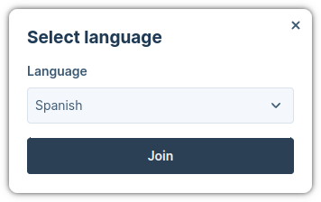
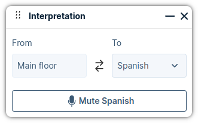
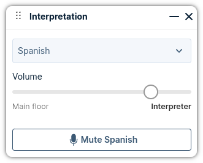

# Web App 3 Plugin: Interpretation

This plugin replicates the behavior of the
[Web App 2 plugin](https://github.com/pexip/plugin-interpretation-webapp2) for
interpretation, but it uses the new Web App 3 plugin system and the React
components.

This plugin should be deployed in the **same domain** as Web App 3 and for this
reason we have some additional steps to test it in a local environment.

In the plugin we have two roles that have to be deployed through brandings:

- **Interpreter:** User that translate what the people is saying in the main
  room.
- **Listener:** User that can join to the interpretation room and listen to what
  the interpreter is saying.

We have two additional brandings in case of a **bidirectional** scenario. This
scenario is when the the interpreter can translate from the main room to the
interpretation room and the other way around.

## How to use

The interface and the plugin capabilities will depend in its configuration.
Specially if the user is a **interpreter** or a **listener**, but there is a

- The user will start the interepretaion by pushing the interpretation button:

  <div align='center'>

  

  </div>

- The next step is to choose the language to which we want to translate to
  (interpreter) or get the translation (listener):

<div align='center'>



</div>

- Once the user is connected, they will see a different interface depending on
  the role:

  - The **interpreter** will see a dialog with the following buttons:
    - Drag and drop on the top-left corner.
    - Minimize in the top-right corner.
    - Close interpretation in the top-right corner.
    - Change language in the selector displaying the current language.
    - Invert translation (button with two arrows) that can reverse the
      translation and instead of translating from the "Main floor" > "Language",
      translate from "Language" > "Main floor".
    - Mute microphone on the bottom.

  <div align='center'>

  

  </div>

  - The **listener** will have a different interface:
    - Drag and drop on the top-left corner.
    - Minimize in the top-right corner.
    - Close interpretation in the top-right corner.
    - Change language in the selector displaying the current language.
    - Slider to balance the mix between the main floor and the interpreter.
    - Mute microphone on the bottom.

  <div align='center'>

  

  </div>

## Deploy a Web App branding for development

The first step is to deploy a two brandings in Infinity that we will use for
testing each one of these roles.

For the brandings we will use the following parameters:

### Interpreter

- **Port:** 5173
- **Branding path:** /interpreter

### Listener

- **Port:** 5174
- **Branding path:** /listener

### Interpreter Bidirectional

- **Port:** 5175
- **Branding path:** /interpreter-bidirectional

### Listener Bidirectional

- **Port:** 5176
- **Branding path:** /listener-bidirectional

This way, one branding will read a plugin from `http://localhost:5173`
(interpreter) and the other from the address `http://localhost:5174` (listener),
so we don't need to upload the plugin every time we want to test it and we can
test both roles at the same time.

To keep it easy, you will find the both brandings in the folder `dev-branding`
of this project.

The steps to install the interpreter branding are the following:

- Compress the folder `dev-branding/interpreter/webapp3` in a file called
  `webapp3.zip`.
- Open the Infinity Management node interface and upload the new branding:
  `Web App > Web App Branding`. You can call this new branding `interpreter`.
- Create a path that points to the new branding: `Web App > Web App Paths`. The
  path to the branding must be `interpreter`.

Now you have to repeat the same process for the `listener`.

## Run for development

Once the branding is deployed we need to configure some parameters:

- Edit `vite.json` with your environment parameters. You only have to modify the
  `infinityUrl` parameter with the URL of your Infinity deployment:

```json
{
  "infinityUrl": "https://192.168.1.101",
  ...
}
```

- Install all the dependencies:

```bash
$ npm i
```

- Run the dev environment:

```bash
$ npm run interpreter
```

or

```bash
$ npm run listener
```

## Configure local policy

An easy way to test the plugin is to use a local policy. In this case we
designed a local policy for testing. It will allow every VMR with 2 or 6 digits
and will use the pins 1234 for the hosts and 4321 for the guests.

```python
{
  
    "action": "continue",
    "result": {
        "service_type": "conference",
        "name": "{{call_info.local_alias}}",
        "service_tag": "pexip-interpreter",
        "description": "",
        "call_tag": "",
        "pin": "1234",
        "guest_pin": "4321",
        "guests_can_present": true,
        "allow_guests": true,
        "view": "four_mains_zero_pips",
        "ivr_theme_name": "visitor_normal",
        "locked": false,
        "automatic_participants": []
     }
  
    {
      "action" : "continue",
      "result" : {{service_config | pex_to_json}}
    }
  
    {
      "action" : "reject",
      "result" : {}
    }
  
}
```

## Build for production

To create a package you need to install first all the dependencies:

```bash
$ npm i
```

And now to create the package itself:

```bash
$ npm run build
```

Congrats! Your package is ready and it will be available in the `dist` folder.

## Configure the plugin

The plugin has a config file (`config.json`) that drives how the plugin behaves.

Here is an example of configuration:

```json
{
  "role": "interpreter",
  "reusePin": true,
  "interpreter": {
    "allowChangeDirection": false
  },
  "listener": {
    "mainFloorVolume": 0.2,
    "speakToInterpretationRoom": false
  },
  "languages": [
    {
      "code": "0033",
      "name": "french"
    },
    {
      "code": "0034",
      "name": "spanish"
    }
  ]
}
```

| Parameter                          | type                           | Description                                                                                                                                                                                                                                                                                                                                                                                            |
| ---------------------------------- | ------------------------------ | ------------------------------------------------------------------------------------------------------------------------------------------------------------------------------------------------------------------------------------------------------------------------------------------------------------------------------------------------------------------------------------------------------ |
| role                               | 'interpreter' \| 'listener'    | Indicates the role of the user that joins to the interpretation. We have two different roles: `interpreter` and `listener`.                                                                                                                                                                                                                                                                            |
| reusePin                           | boolean                        | If `true` the application will reuse the pin of the main floor to the interpretation room. The only requirement is that the PIN should be included in the URL. It isn't supported if the user introduce the PIN manually.                                                                                                                                                                              |
| interpreter.allowChangeDirection   | boolean                        | If `true` the interpreter will be able to change the direction. He will be able to translate from the main floor to the interpretation room and the other way around. He will also be able to listen to the interpretation room.                                                                                                                                                                       |
| listener.mainFloorVolume           | number                         | Float value between 0 and 1 that indicates the percentage of the main floor that the `listener` will hear when he is connected to the interpretation room. The user will be able to change this manually.                                                                                                                                                                                              |
| listener.speakToInterpretationRoom | boolean                        | If enable, the listener will talk to the interpretation room instead of the main room.                                                                                                                                                                                                                                                                                                                 |
| languages                          | {code: string, name: string}[] | The list of all the available languages. Each language will have two values: `code` and `name`. The `code` is the suffix that will be attached to the conference name. For example, if for the main conference we have `conferenceAlias=123` and `code=0033`, the system will create a new audio conference with `conferenceAlias=1230033`. The `name` is used for the UI elements, such as selectors. |

The parameter `allowChangeDirection` needs an additional explanation. With this
parameter enabled, the interpreter can translate in both direction; from the
main room to the interpretation room and the other way around. Here is a
description of the behavior when the interpreter and listener are connected to
the interpretation:

- `interpreter.allowChangeDirection = false && listener.speakToInterpretationRoom = false`:
  In this case the interpreter only can translate from the main room to a
  interpretation room. Here are some details about each role:

  | Device  | Role        | Main Room | Interpretation Room |
  | ------- | ----------- | --------- | ------------------- |
  | Mic     | Interpreter | ❌        | ✅                  |
  | Mic     | Listener    | ✅        | ❌                  |
  | Speaker | Interpreter | 100%      | 100 %               |
  | Speaker | Listener    | ~10%      | ~90%                |

  **Note:** The interpreter also have 100% volume in the Interpretation Room to
  detect if another interpreter joins to the same channel. In other case, both
  interpreters will start translating at the same time without being aware of
  the other.

- `interpreter.allowChangeDirection = true && listener.speakToInterpretationRoom = true`:
  In this case the interpreter can change the direction of the translation. He
  can translate from the Main Room to the Interpretation Room and the other way
  around. In this case we have two other behavior based on the direction:

  - **Main Room -> Interpretation Room:**

    | Direction | Role        | Main Room | Interpretation Room |
    | --------- | ----------- | --------- | ------------------- |
    | Mic       | Interpreter | ❌        | ✅                  |
    | Mic       | Listener    | ❌        | ✅                  |
    | Speaker   | Interpreter | 100%      | 100%                |
    | Speaker   | Listener    | ~10%      | ~90%                |

    **Notes:** The interpreter will listen both channels at the same time. The
    listener can only talk to the interpreter. The people of the Main Room won't
    listen to the listener directly ever.

  - **Interpretation Room -> Main Room:**

    | Direction | Role        | Main Room | Interpretation Room |
    | --------- | ----------- | --------- | ------------------- |
    | Mic       | Interpreter | ✅        | ❌                  |
    | Mic       | Listener    | ❌        | ✅                  |
    | Speaker   | Interpreter | 100%      | 100%                |
    | Speaker   | Listener    | ~10%      | ~90%                |

    **Notes:** Now the interpreter will talk to the main room and the listener
    can still follow the conversation (~10% volume).

In both cases, if the interpreter leaves the interpretation room or if he is
muted, we put the volume of the main room to 100% for the listener and we
disable the slider.
